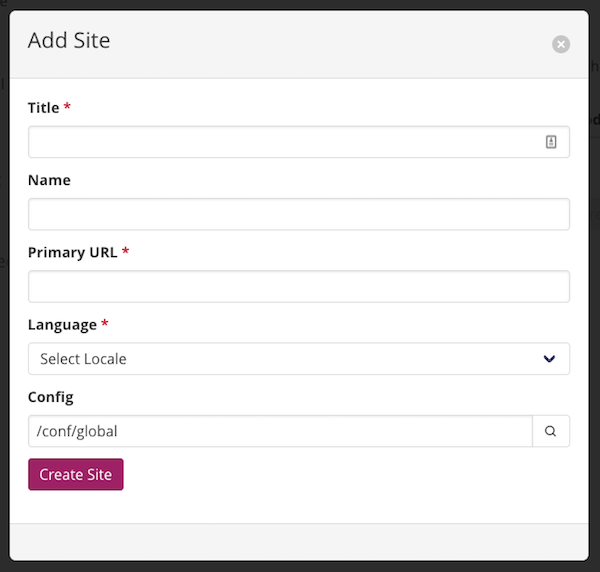

[Apache Sling](https://sling.apache.org) > [Sling CMS](https://github.com/apache/sling-org-apache-sling-app-cms) > [Administration](administration.md) > Configuring a Site

# Configuring a Site

Sites are the basis of Sling CMS' content structure. Each site belongs in a Site Group, which can be considered a tenant or simply a group of sites. This allows you to easily assign permissions and organize related sites.

## Creating a Site Grupe

To create a Site Group, expand *Sites* in the left navigation and select *+Site Group*, this will open a new modal window for you to create the new Site Group. 

The title can be anything you wish, though terse but informative is best. You can either specify a name or one will be generated from the title. 

Generally speaking, you should specify a configuration. This configuration will determine what templates and components will be available in the site as well as other configurations. If creating nexted Site Groups, this may not be necessary as they will be inherited.

## Creating a Site

Once you have a Site Group created, you can create a site. Select the Site Group and then select *+Site* from the top bar, this will open a new modal window for you to create the new Site. 

The title can be anything you wish, though terse but informative is best. You can either specify a name or one will be generated from the title. 

The Primary URL is used to generate the published URLs for the pages in the site. This should be a fully-qualified url with the expected protocol for the site.

The language allows you to select from any of the valid system languages. 

Finally, you can specify a config, but by default, the site will inherit from the parent Site Group. 