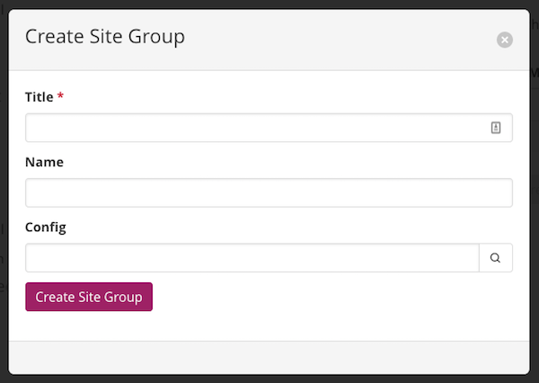
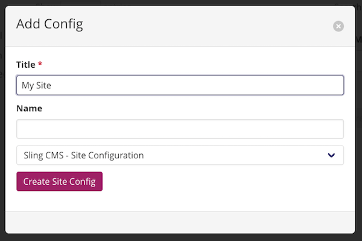
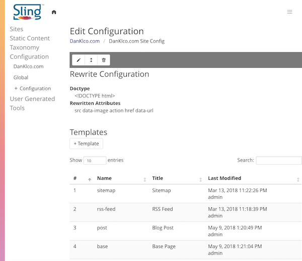

<!-- Licensed to the Apache Software Foundation (ASF) under one or more contributor 
	license agreements. See the NOTICE file distributed with this work for additional 
	information regarding copyright ownership. The ASF licenses this file to 
	you under the Apache License, Version 2.0 (the "License"); you may not use 
	this file except in compliance with the License. You may obtain a copy of 
	the License at http://www.apache.org/licenses/LICENSE-2.0 Unless required 
	by applicable law or agreed to in writing, software distributed under the 
	License is distributed on an "AS IS" BASIS, WITHOUT WARRANTIES OR CONDITIONS 
	OF ANY KIND, either express or implied. See the License for the specific 
	language governing permissions and limitations under the License. -->
[Apache Sling](https://sling.apache.org) > [Sling CMS](https://github.com/apache/sling-org-apache-sling-app-cms) > [Administration](administration.md) > Configuring a Site

# Configuring a Site

Sites are the basis of Sling CMS' content structure. Each site belongs in a Site Group, which can be considered a tenant or simply a group of sites. This allows you to easily assign permissions and organize related sites.

## Creating a Site Grupe

To create a Site Group, expand *Sites* in the left navigation and select *+Site Group*, this will open a new modal window for you to create the new Site Group. 

The title can be anything you wish, though terse but informative is best. You can either specify a name or one will be generated from the title. 

Generally speaking, you should specify a configuration. This configuration will determine what templates and components will be available in the site as well as other configurations. If creating nexted Site Groups, this may not be necessary as they will be inherited.

## Creating a Site

Once you have a Site Group created, you can create a site. Select the Site Group and then select *+Site* from the top bar, this will open a new modal window for you to create the new Site. 

The title can be anything you wish, though terse but informative is best. You can either specify a name or one will be generated from the title. 

The Primary URL is used to generate the published URLs for the pages in the site. This should be a fully-qualified url with the expected protocol for the site.

The language allows you to select from any of the valid system languages. 

Finally, you can specify a config, but by default, the site will inherit from the parent Site Group. 

## Site Configurations

Sling CMS uses Context Aware configuration to configure the sites. By default, you can use the configuration at */conf/global*, but you will probably want to create a custom configuration for real-world uses.

To create a configuration, open the *Configuration* left nav and select *+Configuration*. This will open a new modal window to create the new configuration. Specify a title, then select the type *Sling CMS - Site Configuration* from the dropdown.

To edit the site configuration, select the title (the edit button only allows you to edit the title of the site configuration).

There are two main configurations in a site configuration:

### Rewrite Configuration

The rewrite configuration configures the [Sling Rewriter](https://sling.apache.org/documentation/bundles/output-rewriting-pipelines-org-apache-sling-rewriter.html). Sling CMS includes a HTML5 compliant serializer. 

There are two fields to configure for the rewriter. Generally, speaking you will want to set the doctype to `<!DOCTYPE html>` to be HTML5-compliant, though this may depend on the markup you intend to produce. 

The rewritten attributes configure which attributes will be rewritten during the rewriting process. Only the attributes listed in this configuration will be updated, so make sure that these attributes only contain paths and that all attributes are added, including data-* attributes.

### Templates

Templates are used to define the structure, allowed components, allowed locations and fields for pages created in Sling CMS. See [Templates](templates.md) for more information.

## Setup Mappings

[Sling Mappings](https://sling.apache.org/documentation/the-sling-engine/mappings-for-resource-resolution.html) work with the Sling Rewriter to support friendly URLs while supporting multi-site configurations. 

To support a simple site with a single domain, you would create a mapping as such:

 - Create a folder with the protocal supported for the domain (e.g. https)
 - Create a Mapping with the domain name and port number for the request, (e.g. www.site.com.443)
 - Set the internal redirect to the path of the site in Sling CMS
 
For a site hosted at https://www.mysite.com, you could expect a configuration such as the following:

    https	
        jcr:primaryType: "sling:OrderedFolder"
        www.mysite.com.443	
            jcr:primaryType: "sling:Mapping"
            sling:internalRedirect: ["/content/sites/mysite"]
            
## Configure Apache Virtual Host

To serve requests to web users, you will need an Apache Web Server to proxy and cache the content. This assumes you have installed Apache httpd 2.4+ and installed the modules mod_proxy and mod_cache.

Create a virtual host configuration file for your site, in CentOS, this will be created at */etc/httpd/conf.d*:

    <VirtualHost *:443>
       ServerName www.mysite.com
       DocumentRoot /var/www/vhosts/www-mysite-com

       # Configure mod_cache
       CacheEnable disk /
       CacheIgnoreNoLastMod On
       CacheRoot /var/cache/httpd/www-mysite-com
       CacheDefaultExpire 600
  
       # Configure Proxy, this assumes you have a Sling CMS instance at localhost:8080
       # Directly proxy content under /static/clientlibs with the full path
       ProxyPass /static/clientlibs/www-mysite-com/ http://localhost:8080/static/clientlibs/www-mysite-com/
       ProxyPassReverse /static/clientlibs/www-mysite-com/ http://localhost:8080/static/clientlibs/www-mysite-com/
       # Proxy other content using Sling Mappings to check under /content/sites/mysite
       ProxyPass / http://localhost:8080/content/sites/mysite/
       ProxyPassReverse /content/sites/mysite/ http://localhost:8080/content/sites/mysite/   
    </VirtualHost>
    
This shows just a very simple configuration without configured client caching, security, etc. Check the Vagrant configuration files for a more complete example of a virtual host.